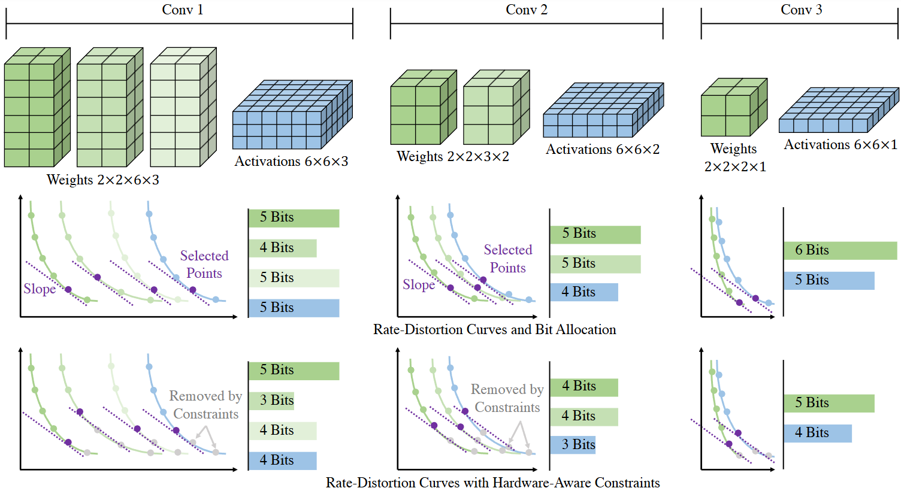

# RDOQ: Effective Fine-Grained Quantization for DNNs via Rate-Distortion Optimization

Official implementation of the TPAMI submission: "RDOQ: Effective Fine-Grained Quantization for DNNs via Rate-Distortion Optimization".




This repository contains code for RDOQ, a novel fine-grained channel-wise quantization approach for DNNs via channel-wise / channel group-wise mixed-precision quantization that achieves a state-of-the-art combination of quantization quality and compression rate.
RDOQ formulates as a rate-distortion optimization problem, and addresses the problem of efficiently exploring the hyperparameter space of channel-wise bit widths. 


# Table of Contents
- [RDOQ: Effective Fine-Grained Quantization for DNNs via Rate-Distortion Optimization](#rdoq-effective-fine-grained-quantization-for-dnns-via-rate-distortion-optimization)
- [Table of Contents](#table-of-contents)
- [Technical Details](#technical-details)
  - [1. First-order Approach](#1-first-order-approach)
  - [2. Second-order Approach (**\**NEW*\***)](#2-second-order-approach-new)
- [Project Structure](#project-structure)
  - [ImageNet classification](#imagenet-classification)
    - [First-order approach](#first-order-approach)
    - [Second-order approach](#second-order-approach)
  - [3D LiDAR based Object Detection](#3d-lidar-based-object-detection)
    - [Preparation:](#preparation)
    - [Running](#running)

# Technical Details

## 1. First-order Approach

We discovered and utilized a first-order additivity property on DNNs, that is able to breakdown the model global output distortion into the individual contribution of weights/activations groups. 
Adopting the Taylor series expansion approximation of the model global output up to first-order item, the first-order additivity property can be expressed as:


which allows us to efficiently solve the fine-grained bit allocation problem using efficient integer programming algorithms.
We propose two integer programming solvers to solve the above allocation problem, namely Lagrangian Formulation and Dynamic Programming.


## 2. Second-order Approach (**\**NEW*\***) 
Noted that in practice, to make [first-order approach](#1-first-order-approach) workds well, we repeatedly samples the model output from all calibration images to form the distortion curves. 
So in our new proposed second-order approach, we managed to significantly reduce the calibration overhead, by properly approximate the real-world distortion curves required in previous first-order approach with second-order approximation.
We also did some complexity optimization on the hessian-related calculation to support fast implementation, which finally gives the following formulations:
- Approx. weight distortion curves:

  

- Approx. activation distortion curves:

  


# Project Structure

This repository contains the post-training quantization implementation of both ImageNet classification and 3D LiDAR based object detection models, organized in the subdirectory respectively:
1. [__ImageNet classification__](#ImageNet-classification): `./classification`
2. [__3D LiDAR based Object Detection__](#3D-LiDAR-based-Object-Detection): `./openpcdet`


## ImageNet classification
Example scripts to evaluate the accuracy on ImageNet validation dataset:

### First-order approach

1. Generate rate-distortion curves for channel groups in ViT layer **weights**.
   ```bash
   CUDA_VISIBLE_DEVICES=0 python3 generate_RD_curves_batch.py \
    --archname deit_base_patch16_224 \
    --datapath=/imagenet/ \
    --modeid=0 --gpuid=0 \
    --nchannelbatch 128 \
    --testsize=64 \
    --batchsize 64 
   ```-
2. Generate rate-distortion curves for channel groups in ViT layer **activations**.
   ```bash
   CUDA_VISIBLE_DEVICES=0 python3 generate_RD_curves_act_out_nchan.py \
    --archname deit_base_patch16_224 \
    --datapath=/imagenet/ \
    --modeid=0 --gpuid=0 \
    --nchannelbatch 128 \
    --testsize=64 \
    --batchsize 64
   ```
3. (Option #1) Lagrangian Formulation method for bit allocation:
   ```bash
   CUDA_VISIBLE_DEVICES=0 python3 generate_RD_frontier_batch_distortion_act_out_nchan.py \
    --archname=deit_base_patch16_224 \
    --maxslopesteps 196 \
    --pathrdcurve=deit_base_patch16_224_ndz_0010_nr_0011_ns_0064_nf_0128_rdcurves_channelwise_opt_dist/ \
    --gpuid=0 \
    --datapath=/imagenet \
    --nchannelbatch=128 \
    --maxrates=11 \
    -bcw -bca
   ```
4. (Option #2) Dynamic Programming method for bit allocation:
   ```bash
   CUDA_VISIBLE_DEVICES=0 python3 generate_DP_batch_distortion_act_out_nchan.py \
    --archname=deit_base_patch16_224 \
    --maxslopesteps 196 \
    --pathrdcurve=deit_base_patch16_224_ndz_0010_nr_0011_ns_0064_nf_0128_rdcurves_channelwise_opt_dist/ \
    --gpuid=0 \
    --datapath=/imagenet \
    --nchannelbatch=128 \
    --maxrates=11 \
    --target_rates 4 6 8 \
    -bcw -bca
   ```

### Second-order approach
We provide an automatic script to perform end-to-end quantization including calibration and bit allocation for second-order approach.
```bash
CUDA_VISIBLE_DEVICES=0,1,2,3 bash gen_rd_hessian_curves_deit_b_224_all.sh
```

USAGE: To run different settings, config the following variables in the above bash script:

- **NCHANNELBATCH**: The number of channels in a channel-group
- **TESTSIZE**: Calibration dataset size
- **BATCHSIZE**: Batch size
- **MODELNAME**: pretrained model name to load from `timm.create_modal()`
- **SOLVER**: "dp" or "lg", for Dynamic Programming and Lagrangian Formulation respectively.
- **DATASET**: path to imagenet


## 3D LiDAR based Object Detection

### Preparation: 

Follow installation instructions in [OpenPCDet](https://github.com/open-mmlab/OpenPCDet)

### Running 

1. Generate rate-distortion curves for channel groups in detection model layer **weights**.
   ```bash
   CUDA_VISIBLE_DEVICES=0 python3 generate_rd_curves_batch.py \
      --batch_size 2 --cfg_file cfgs/nuscenes_models/cbgs_voxel0075_voxelnext_vtc.yaml \
      --pretrained_model path/to/model.pth.tar \
      --workers 1
   ```

2. Dynamic Programming method for bit allocation:
   ```bash
   CUDA_VISIBLE_DEVICES=0 python3 generate_DP_frontier_batch_act_nchan.py \
    --batch_size 32 --workers 4 \
    --cfg_file cfgs/nuscenes_models/cbgs_voxel0075_voxelnext_vtc.yaml \
    --pretrained_model path/to/model.pth.tar \
    --nchannelbatch 128 \
    --pathrdcurve VoxelNeXt_ndz_0010_nr_0011_ns_0001_nf_0128_rdcurves_channelwise_opt_dist/ \
    --target_rates 2 4 6 8 -bcw
   ```